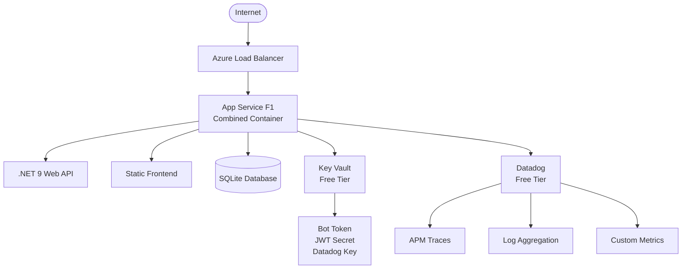

# AjudadoraBot - Azure Free Tier Deployment

[](https://portal.azure.com/#create/Microsoft.Template)
[](https://datadoghq.com)
[](https://azure.microsoft.com/en-us/free/)

> **Cost-Optimized Telegram Bot** deployed on Azure Free Tier with Datadog monitoring, designed to run at zero or minimal cost.

## 🎯 Features

- **💰 Cost Optimized**: Runs on Azure Free Tier (F1 App Service Plan)
- **🔄 Combined Deployment**: Single container with backend API + frontend
- **📊 Datadog Monitoring**: APM, logs, and metrics on free tier
- **🔒 Secure**: Key Vault integration for secrets management
- **🚀 CI/CD**: GitHub Actions with automated deployment
- **📱 Telegram Mini App**: Interactive web interface
- **💾 SQLite Database**: Lightweight, serverless database

## 📊 Free Tier Resources Used

| Service | Tier | Monthly Cost | Limits |
|---------|------|--------------|--------|
| App Service | F1 (Free) | $0 | 60 min/day, 1GB storage |
| Key Vault | Standard | $0* | 25K operations/month |
| Container Registry | GitHub (Free) | $0 | Unlimited public repos |
| Datadog | Free | $0 | 5 hosts, 1-day retention |
| **Total** | | **~$0/month** | With free tier benefits |

*\*Key Vault charges $0.03 per 10K operations after free limit*

## 🚀 Quick Start

### 1. Prerequisites

- Azure account with free tier benefits
- GitHub account
- Datadog account (free tier)
- Telegram Bot Token from [@BotFather](https://t.me/botfather)

### 2. Deploy with One Click

#### Option A: Automated Deployment (Recommended)

1. **Fork this repository**
2. **Set up repository secrets**:
   ```
   AZURE_CREDENTIALS          # Service principal JSON
   AZURE_CLIENT_ID            # Service principal client ID  
   AZURE_CLIENT_SECRET        # Service principal secret
   AZURE_SUBSCRIPTION_ID      # Azure subscription ID
   AZURE_TENANT_ID           # Azure tenant ID
   TELEGRAM_BOT_TOKEN        # From @BotFather
   DATADOG_API_KEY          # From Datadog dashboard
   ALERT_EMAIL              # For cost monitoring alerts
   ```

3. **Configure Terraform variables**:
   ```bash
   cp terraform/terraform.tfvars.example terraform/terraform.tfvars
   # Edit terraform.tfvars with your values
   ```

4. **Push to main branch** to trigger deployment:
   ```bash
   git push origin main
   ```

#### Option B: Manual Deployment

1. **Clone repository**:
   ```bash
   git clone https://github.com/yourusername/ajudadorabot.git
   cd ajudadorabot
   ```

2. **Deploy infrastructure**:
   ```bash
   # Windows
   .\scripts\deploy-free-tier.ps1 -SubscriptionId "your-sub-id"
   
   # Linux/macOS
   cd terraform
   terraform init && terraform apply
   ```

3. **Build and deploy container**:
   ```bash
   docker build -f Dockerfile.combined -t ajudadorabot .
   # Push to GitHub Container Registry and deploy
   ```

### 3. Configure Telegram Bot

1. **Set webhook** (replace with your App Service URL):
   ```bash
   curl -X POST "https://api.telegram.org/bot<YOUR_BOT_TOKEN>/setWebhook" \
     -d "url=https://your-app.azurewebsites.net/webhook"
   ```

2. **Configure bot commands** via @BotFather:
   ```
   start - Start using the bot
   help - Get help and commands  
   webapp - Open Mini App
   ```

3. **Test your bot**: Send `/start` to your bot on Telegram

## 📊 Monitoring & Cost Management

### Monitor Usage Daily

```bash
# Check free tier usage (Linux/macOS)
./scripts/monitor-free-tier.sh

# Check free tier usage (Windows)
.\scripts\deploy-free-tier.ps1 -MonitorOnly
```

### Key Limits to Monitor

- ⏱️ **Compute Time**: 60 minutes/day (app sleeps after limit)
- 💾 **Storage**: 1GB total (includes app + database)  
- 🌐 **Bandwidth**: 165MB/day outbound data
- 🔑 **Key Vault**: 25,000 operations/month
- 📊 **Datadog**: 5 hosts maximum, 1-day retention

### Cost Alerts Configured

Automatic alerts when approaching limits:
- CPU usage > 70%
- Memory usage > 80% 
- Bandwidth > 70% of daily limit
- HTTP errors increase

## 🏗️ Architecture



## 🔧 Development

### Local Development

1. **Requirements**:
   - .NET 9 SDK
   - Node.js 20+
   - Docker
   - SQLite

2. **Setup**:
   ```bash
   # Backend
   dotnet restore
   dotnet run --project src/AjudadoraBot.Api
   
   # Frontend (in separate terminal)
   cd frontend
   npm install
   npm start
   ```

3. **Environment Variables**:
   ```bash
   export TELEGRAM_BOT_TOKEN="your-bot-token"
   export JWT_SECRET="your-jwt-secret"
   export DD_API_KEY="your-datadog-key"  # Optional for local dev
   ```

### Testing

```bash
# Run all tests
dotnet test

# Run specific test categories
dotnet test --filter Category=Unit
dotnet test --filter Category=Integration

# Frontend tests
cd frontend && npm test
```

## 📁 Project Structure

```
ajudadorabot/
├── src/
│   ├── AjudadoraBot.Api/          # Web API project
│   ├── AjudadoraBot.Core/         # Domain models & interfaces
│   └── AjudadoraBot.Infrastructure/ # Data access & services
├── frontend/                       # Telegram Mini App
├── terraform/                      # Infrastructure as Code
├── .github/workflows/             # CI/CD pipelines
├── scripts/                       # Deployment & monitoring scripts
├── docs/                          # Documentation
├── Dockerfile.combined            # Cost-optimized container
└── docker-compose.yml            # Local development
```

## 🔒 Security

### Production Security Features

- ✅ HTTPS only (enforced)
- ✅ Managed Identity for Key Vault access
- ✅ All secrets in Key Vault
- ✅ Minimum TLS 1.2
- ✅ FTPS disabled
- ✅ JWT authentication for Mini App

### Free Tier Limitations

- ❌ No Web Application Firewall (WAF)
- ❌ No Virtual Network integration
- ❌ No custom SSL certificates
- ❌ No Azure AD integration

## 🚨 Troubleshooting

### Common Issues

**App stops responding after ~1 hour**
- **Cause**: Exceeded 60-minute daily compute limit
- **Solution**: Wait for daily reset (UTC midnight)
- **Prevention**: Optimize code, implement caching

**High bandwidth usage**
- **Cause**: Large responses or uncompressed assets
- **Solution**: Enable compression, optimize images
- **Monitor**: Check Azure metrics regularly

**Database connection errors**
- **Cause**: SQLite file locking
- **Solution**: Restart App Service
- **Prevention**: Use WAL mode, connection pooling

### Debug Commands

```bash
# Check app status
az webapp show --name "your-app-name" --resource-group "your-rg"

# View logs
az webapp log tail --name "your-app-name" --resource-group "your-rg"

# Test health
curl https://your-app.azurewebsites.net/health
```

## 📈 Scaling Path

When you outgrow free tier limits:

1. **Basic B1** ($13.14/month):
   - Always On available
   - Custom domains
   - 1.75GB RAM, 10GB storage

2. **Standard S1** ($56.94/month):
   - 5 deployment slots
   - Auto-scaling
   - Custom SSL certificates

3. **Premium P1v3** ($116.80/month):
   - Enhanced performance
   - VNet integration
   - Private endpoints

## 🤝 Contributing

1. Fork the repository
2. Create feature branch: `git checkout -b feature/amazing-feature`
3. Commit changes: `git commit -m 'Add amazing feature'`
4. Push to branch: `git push origin feature/amazing-feature`
5. Open Pull Request

## 📄 License

This project is licensed under the MIT License - see the [LICENSE](LICENSE) file for details.

## 🆘 Support

- 📖 **Documentation**: [Free Tier Deployment Guide](docs/FREE_TIER_DEPLOYMENT.md)
- 🐛 **Issues**: [GitHub Issues](https://github.com/yourusername/ajudadorabot/issues)
- 💬 **Discussions**: [GitHub Discussions](https://github.com/yourusername/ajudadorabot/discussions)
- 📧 **Email**: support@yourdomain.com

---

**⚡ Built for Azure Free Tier | 🤖 Powered by Telegram | 📊 Monitored by Datadog**

*Deploy a production-ready Telegram bot for free!*